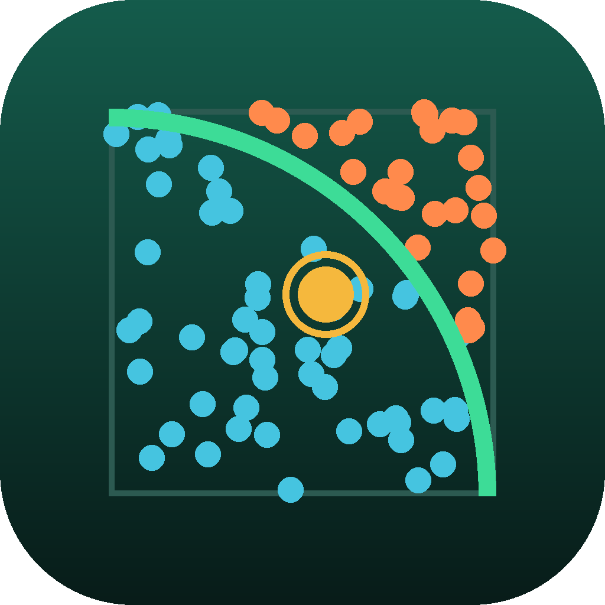

# Monte Carlo Simulator

**Aprende simulación probabilística ejecutando experimentos computacionales: azar, riesgo y estimaciones.**

App móvil educativa (Flutter · Android/iOS) de la *Educational Mobile Apps Factory*. Transversal a todas las carreras: ingenierías, ciencias, ciencias empresariales y humanidades.

<p align="center"></p>

---

## Qué resuelve

Los estudiantes aprueban «simulación» corriendo una planilla, pero leen mal lo que sale. El diagnóstico previo encontró ocho fallos recurrentes y la app está construida para atacarlos uno por uno:

| # | Fallo | Dónde se trabaja |
|---|---|---|
| F1 | Tratar una corrida como «la» respuesta, sin su error | Lluvia de puntos · Cinco semillas |
| F2 | Creer que el error baja con n (baja con √n) | ¿Cuánto mejora con más iteraciones? |
| F3 | Falacia de los promedios: g(E[X]) ≠ E[g(X)] | Capacidad · Rutas paralelas · VAN |
| F4 | Elegir mal la distribución o ignorar la correlación | La forma de la entrada · Riesgos que se mueven juntos |
| F5 | Reportar solo la media; leer mal percentiles y colas | Curva S · Dos opciones, dos riesgos |
| F6 | «0 casos ⇒ probabilidad 0»; eventos raros con pocas iteraciones | Eventos raros |
| F7 | Confundir precisión (n) con validez (modelo) | Analista · Sensibilidad y validación |
| F8 | Acertar sin entender | Regla 60/40 en las decisiones |

## Los tres módulos pedidos

| Módulo | Tema | Lecciones | Laboratorios |
|---|---|---|---|
| 1 · Concepto Monte Carlo | Azar | Estimar con azar · Generadores y semillas · Transformada inversa · Toda estimación tiene error | Lluvia de puntos · Fábrica de azar |
| 2 · Simulación | Riesgo | Anatomía de un modelo · Elegir distribuciones · Falacia de los promedios · Dependencia | Riesgo en proyectos · Trampas del modelo |
| 3 · Análisis | Estimaciones | Leer la distribución · Riesgo y decisión · ¿Cuántas iteraciones? · Sensibilidad y validación | Precisión y eventos raros · Leer y decidir |

Cada experimento sigue **Predice → Simula → Explica**: los controles se bloquean hasta registrar la predicción y el hallazgo se desbloquea al alcanzar un mínimo de repeticiones.

## Además

- **Simulador libre**: define entradas inciertas (7 distribuciones), escribe la fórmula de la salida, fija un umbral de riesgo y, si quieres, una correlación. 8 plantillas (VAN de proyecto, capacidad, plazos en paralelo, costos correlacionados, inventario, π, contaminante, modelo en blanco) y los modelos de los casos.
- **Analista de resultados (IA)**: motor determinista que lee la corrida —precisión, probabilidad del umbral, colas, asimetría, falacia de los promedios, escenario más probable, sensibilidad, supuestos— y responde preguntas. IA generativa **opcional** con la clave del usuario: solo redacta sobre las cifras del motor; si escribe un número que el motor no calculó, su respuesta se descarta.
- **Práctica**: 36 ítems (4 formatos) y práctica generativa ilimitada.
- **11 casos profesionales**, uno por carrera, con 3 pasos evaluados.
- **Diagnóstico de confusiones**: 25 confusiones catalogadas; cada distractor declara cuál produce.

## Estructura

```
monte_carlo_simulator/
├── lib/
│   ├── core/            # RNG xoshiro128**, distribuciones, estadística, tema, formato
│   ├── domain/          # Dart puro: motor, contenido, lógica de laboratorios, analista, progreso
│   ├── data/            # SharedPreferences y clientes HTTP de la IA opcional
│   └── presentation/    # pantallas, pintores propios, Riverpod
├── assets/icon/         # icono (generado por tool/generate_icon.py)
├── test/                # 8 suites + fixtures/figures.json
├── tool/                # réplica Python, verificadores, icono, postcreate
├── docs/                # 00–08: producto, especificación, arquitectura, QA, despliegue
└── .github/workflows/   # ci.yml y build-apk.yml
```

Las carpetas `android/` e `ios/` **no se versionan**: se generan en CI con `flutter create` de la versión fijada y se parchean con `tool/postcreate.py`.

## Compilar localmente

```bash
flutter --version            # 3.35.4 (la fijada en CI)
flutter create --platforms=android,ios --org com.educationalfactory --project-name monte_carlo_simulator .
python3 tool/postcreate.py
flutter pub get
dart run flutter_launcher_icons
flutter analyze
flutter test
flutter run                  # o: flutter build apk --release
```

## CI/CD

- **`ci.yml`** — en cada push/PR: integridad del contenido y verificación estática (Python + tree-sitter), luego `flutter analyze` y `flutter test`.
- **`build-apk.yml`** — en `main` y etiquetas `v*`: APK universal y por arquitectura como artefacto; en etiquetas publica un *release*. Firma de depuración salvo que existan los secretos `ANDROID_KEYSTORE_BASE64`, `ANDROID_KEYSTORE_PASSWORD`, `ANDROID_KEY_ALIAS`, `ANDROID_KEY_PASSWORD`.

Para publicar: sube el repositorio a GitHub, espera el workflow **Build APK** y descarga el artefacto `monte-carlo-simulator-apk`. Para un release: `git tag v1.0.0 && git push --tags`.

## Verificación sin SDK

```bash
pip install scipy tree-sitter tree-sitter-language-pack
python3 tool/replica.py          # recalcula las 114 cifras con SciPy → test/fixtures/figures.json
python3 tool/verify_content.py   # cifras, confusiones, referencias, ítems, hallazgos
python3 tool/static_check.py     # sintaxis, imports, símbolos importados, argumentos con nombre
```

`static_check.py --ref <fuentes de Flutter>` verifica además los argumentos con nombre de los widgets de Flutter y los miembros estáticos (`Icons.x`, enums).

## IA opcional

Ajustes → IA opcional del analista: Anthropic (Claude) o cualquier API compatible con OpenAI (incluido un proxy institucional). La clave se guarda solo en el dispositivo. Sin clave, la app funciona completa y sin conexión.

## Licencia

MIT. Ver [LICENSE](LICENSE).
